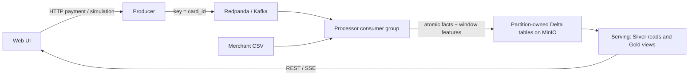

# Real-time Fraud Detection on Kubernetes

Course: Cloud Computing und Big Data - Pruefungsleistung 2026

This prototype implements a Kappa payment-event pipeline with a separately deployed web UI.
The current v2 implementation fixes recovery and cross-processor aggregation. Python tests and
Helm rendering have been checked; **a new Kubernetes run and fresh screenshots are still required**.
The images in section 11 come from the earlier implementation and are explicitly labelled.

## 1. Use Case und Motivation

Payment providers need to identify high-value purchases, risky merchants and repeated attempts
from one card while payments are arriving. This prototype produces explainable review signals;
it does not block real payments or claim to estimate calibrated fraud probabilities.

The primary source is synthetic JSON from the producer API or a manual UI payment.
The enrichment source is [merchant reference data](data/merchants.csv): category, country and risk.
Synthetic data avoids personal cardholder data and makes specific scenarios easy to demonstrate.
The generator balances amount-only, merchant-only and combined flagged examples. An optional
15-payment same-card burst independently demonstrates velocity detection.

This is a Big Data use case because the input is an unbounded, time-sensitive event stream,
with history needed across many cards. Partitioned ingestion, durable storage and independent
compute services allow concurrency to grow. The implementation is a laptop-scale prototype.

## 2. Datencharakteristik

| V | Application |
| --- | --- |
| Volume | An illustrative production design point of 5,000 events/s implies 432 million/day, approximately 216 GB/day at 500 bytes/event before replication. These are design assumptions, not measured throughput. |
| Velocity | Kafka ingestion is continuous. The processor polls up to 25 events with a one-second timeout and writes each nonempty partition batch immediately. Storage latency adds to that delay. |
| Variety | JSON payments and CSV merchant data become typed Delta facts, window features and category query results. |
| Veracity | Pydantic validates API requests; invalid event-time is marked and uses the Kafka record timestamp for deterministic replay. |
| Value | Reviewers can distinguish amount, merchant-risk and rapid-repetition signals. |

## 3. Architekturentscheidung: Kappa vs. Lambda

Kappa is appropriate because live traffic and replay use the same Kafka topic and the same
enrichment/window code. A separate Lambda batch path would duplicate these rules. Kafka is the
retained raw log; Delta stores durable derived facts. There is no additional Bronze copy.




Each Kafka partition has a separate Delta table. This separates writers while keeping stable
storage ownership when consumer-group assignments change. One atomic record contains the enriched
payment and velocity features. Gold `card_velocity` and `fraud_stats` are **query views over those
facts**, not independently committed tables. This removes partial commits across Silver/Gold and
process-local cumulative category snapshots that previously lost counts during scale-out.

Replay into an existing prefix skips Kafka offsets already present in Delta. To rebuild using
changed rules, use a **new storage prefix and a new consumer group**, then point serving at that
prefix after catch-up. Never delete existing tables to trigger replay. Only retained Kafka records
can be rebuilt; the broker retention and earliest available offsets bound recovery of raw history.

## 4. Komponenten und Datenfluss

| Component | Choice and rationale |
| --- | --- |
| Producer | FastAPI and kafka-python-ng validate input and publish messages keyed by card. It checks the returned Kafka Future before reporting acceptance. |
| Kafka | Redpanda provides the replayable Kafka log with six partitions. The scale profile uses three brokers with unique identities, RPC addresses and a shared seed. |
| Processor | Python + delta-rs keep enrichment and window calculations visible without a JVM cluster. State is recoverable from persisted partition facts. |
| Storage | MinIO provides S3-compatible object storage and separates compute from persistent data; Delta adds typed Parquet, atomic table commits and version history. |
| Serving | FastAPI reads partition tables, deduplicates Kafka coordinates and computes Gold category aggregates across every partition. The version-aware cache avoids rereading unchanged facts for SSE clients. |
| UI | HTML/JavaScript in a separate nginx container submits events and displays real serving output, using same-origin reverse proxies. |

The end-to-end path is UI → producer acknowledgement → Kafka → merchant enrichment and window
features → atomic Delta write → serving queries → UI update. A successful enqueue acknowledgement
does not mean the processor has already finished; downstream visibility follows the Delta commit.

## 5. Processing-Logik

### Transformations and rules

Merchant enrichment joins each `merchant_id` to the CSV. Amount above EUR 800 or merchant risk
at least 0.7 flags a payment. The severity score is:

`0.5 * min(amount / 1600, 1) + 0.5 * merchant_risk`

This score ranks signals and is not a learned probability or the binary decision threshold.
The thresholds are explainable prototype choices: normal synthetic purchases are EUR 1–250,
high-amount examples start at EUR 900, and more than ten payments in a minute models card testing.
The generator's requested flagged ratio applies to base events, excluding the velocity-only burst.

### Window state and recovery

For each payment at event-time `t`, the processor calculates count, amount sum and maximum score
in the same-card interval `[t-60s, t]`. A count above ten emits a velocity alert. This interval is
evaluated against accepted events observed so far; already emitted velocity results are not revised
when later arrivals have older timestamps.

State is keyed by card **within its Kafka partition**. The partition's maximum event-time acts as
a watermark: events older than maximum minus 120 seconds are excluded from velocity and category
views, but remain in Silver with `velocity_excluded=1`. `is_late` means older than that partition
maximum. The same rule applies to new and previously seen cards. Cleanup uses the same watermark
and removes inactive keys outside the 60+120 second horizon. Memory is bounded by accepted events
inside that horizon, not by a fixed event count; a burst within the horizon can still be large.

On assignment or restart, `recover()` reads the partition's durable facts, deduplicates source
coordinates and reconstructs the maximum event-time and retained card history. Already stored
offsets are skipped. This includes the case where Delta succeeded but Kafka offset commit did not.
Kafka offsets are committed only after the atomic Delta write. Ordinary restarts and rebalances
therefore preserve the eleventh-payment alert instead of resetting its counter.

### Category windows and late data

Each event stores its fixed one-minute window boundaries. `/stats` groups accepted, deduplicated
facts by window and merchant category, sums flags and computes the mean score across **all**
partitions. There is no last-snapshot-wins selection. Late arrivals cannot replace an old complete
aggregate with `total=1`; accepted late records contribute normally and too-late records are excluded.

Missing/invalid timestamps use the Kafka record timestamp and set `event_time_fallback=1`.
`POST /transactions` accepts an optional string `event_time` for late-data demonstrations.
Kafka coordinates `(source_topic, source_partition, source_offset)` identify replay duplicates;
two separately published payments with the same application transaction ID are not deduplicated.

### Delivery semantics

Producer uses `acks=all`, five retries and one in-flight request per connection; each Future is
checked. Delta stores facts and features together, avoiding three independent output commits.
The MinIO backend uses conditional PUT rather than unsafe rename. Serving deduplicates coordinates.
The overall claim remains at-least-once, not a universal exactly-once guarantee under arbitrary
network partitions or overlapping stale consumer owners. The prototype has no external fencing
lease for such a split-brain scenario. Do not change topic partition count or recreate the topic
against the same prefix; use a new generation and replay so card ownership and offsets remain valid.

## 6. Speicherkonzept

Delta tables are stored under:

`s3://fraud/v2/silver/transactions/partition-<Kafka partition>/`

Each is date-partitioned by `event_date`. Table-per-Kafka-partition separates normal concurrent
writers; date partitioning supports future pruning and retention. Gold views use the same durable
records, making category aggregation independent of which processor wrote each event. There is
no separate persistent Gold table in v2.

The explicit [Arrow schema](services/processor/app.py) fixes strings, float64 values and int64
flags/offsets even when a batch contains null coordinates. Event/window times are UTC ISO-8601
strings intentionally, not native Arrow timestamps. `lat`, `lon`, `user_id`, `country` may be null;
the remaining schema fields are non-nullable. Writes enable schema merge for additive evolution;
semantic rule changes require a new prefix and replay, not just schema merge.

Delta was selected over plain Parquet for atomic commits and versioned snapshots. A Lakehouse
keeps object storage independent of replaceable processors/readers and supports evolving event
data without introducing a warehouse. The current serving and recovery paths read whole partition
tables at laptop scale; a production system would use filtered recovery/checkpoints, compaction
and an incremental query store. No production-scale benchmark is claimed.

## 7. User-facing UI

The UI is both data supplier and result consumer. A form sends `/api/producer/transactions`;
the generator sends `/api/producer/simulate`. nginx forwards these to the producer service.
The dashboard uses serving REST and SSE through `/api/serving/`; no mock data is used.

Open the UI, submit a payment or request a simulation, wait for processing, and inspect the updated
summary, flagged-payment reasons and velocity alerts. Search/filter operates on the latest 100
flagged records and displays up to 15, with the total flagged count stated separately. SSE has a
three-second polling fallback. Simulation returns a schedule immediately; estimated duration is
the pacing lower bound and does not include Kafka acknowledgement/processing latency.

## 8. Kubernetes-Deployment

The [Helm chart](deploy/helm/fraud-pipeline) declares all components, Services, configuration and PVCs.
Producer, processor, serving and UI use Deployments. Redpanda and MinIO use StatefulSets with
headless Services and persistent volumes. ConfigMaps contain endpoints, thresholds and merchant
data; a Secret supplies storage credentials. All main containers declare resources and probes.
Producer readiness checks its Kafka connection; processor probes check recent poll progress.

| Component | Horizontal scale path |
| --- | --- |
| Producer / serving / UI | HPA; scale profile starts at two replicas for each. |
| Processor | Kafka consumer group, two replicas in scale profile; optional KEDA up to six, bounded by fixed topic partitions. Assignment restores partition history. |
| Kafka | Three brokers in scale profile; unique pod DNS/node IDs and RPC seed configuration. New topics use replication factor three. |
| MinIO | Four servers in an erasure-coded pool in scale profile. Add complete pools with `minio.poolCount`, keeping servers-per-pool unchanged. |

MinIO uses `OnDelete` updates in distributed mode because every server must adopt the same pool
endpoint list. An expansion requires a coordinated pod restart after the Helm update, not changing
the size of an existing pool. Persistent PVCs must be retained. A standalone installation must not
be converted to distributed mode in place; use the fresh-namespace instructions below.

The scale topology has been rendered and structurally checked. **Runtime scaling has not yet been
demonstrated for v2.** Section 11 states the missing evidence rather than claiming that HPA presence
or configured replicas proves a successful deployment.

## 9. Deployment-Anleitung

### Prerequisites and image build

Install Docker, Minikube, kubectl and Helm v3. For the scale profile, start with approximately
8 CPUs and 12 GB RAM available to Minikube (a planning allowance, not a measured minimum):

```bash
minikube start --cpus=8 --memory=12288
minikube addons enable metrics-server
docker build -t local/fraud-producer:dev services/producer
docker build -t local/fraud-processor:dev services/processor
docker build -t local/fraud-serving:dev services/serving
docker build -t local/fraud-ui:dev services/ui
minikube image load local/fraud-producer:dev
minikube image load local/fraud-processor:dev
minikube image load local/fraud-serving:dev
minikube image load local/fraud-ui:dev
```

For k3d, use `k3d image import`; for a remote cluster push images to its registry and override
`images.*`. The cluster must have a default StorageClass capable of provisioning the requested PVCs.

### Fresh scale demonstration

```bash
helm upgrade --install fraud-pipeline deploy/helm/fraud-pipeline --namespace fraud-scale --create-namespace -f deploy/helm/fraud-pipeline/values-scale.yaml
kubectl -n fraud-scale wait --for=condition=ready pod --all --timeout=600s
kubectl -n fraud-scale get pods -o wide
kubectl -n fraud-scale get hpa,statefulset,deployment,pvc
kubectl -n fraud-scale port-forward svc/ui 8080:8080
```

Open `http://localhost:8080`. For a smaller fresh lab, omit `-f .../values-scale.yaml` and use
another namespace such as `fraud-lab`; this single-node mode is not evidence of full scale-out.
Do not use `--wait` as a substitute for the documented post-install readiness check: bucket creation
is a Helm post-install Job. If startup fails, inspect `kubectl describe pod` and container logs.

To enable lag-based processor scaling, install the KEDA operator first, then pass
`--set keda.enabled=true` in addition to the same values file. HPA-managed Deployments omit static
replicas so Helm does not overwrite an autoscaler's decision.

For storage expansion of the distributed demo, keep all existing settings and pass
`--set minio.poolCount=2`; this adds four servers and four PVCs. After the update, restart MinIO pods
in a coordinated maintenance window (`kubectl -n fraud-scale delete pod -l app=minio`), retaining
the StatefulSet and PVCs. Wait for all eight pods, check `mc admin info`, then verify historical data
and a new payment. This procedure is supplied for verification and has not been executed here.

### Migration and replay

The new default prefix `v2` and group `fraud-processor-v2` leave old tables intact. Existing retained
Kafka events are replayed into the new schema. If those events have expired, old v1 data stays in
its original paths but is not shown by the v2 serving layer. For another rebuild, set both
`storage.prefix` and `keda.processor.consumerGroup` to new generation names. Keep six topic
partitions unchanged. Resetting offsets alone does not rebuild already persisted v2 records.

### Tests and packaging

Install the relevant service requirements, then run tests separately (each service has `app.py`):

```bash
python -m unittest discover -s services/producer -p 'test_*.py'
python -m unittest discover -s services/processor -p 'test_*.py'
python -m unittest discover -s services/serving -p 'test_*.py'
pip install PyYAML==6.0.3
python scripts/check_chart.py
```

On Windows, delta-rs 0.24 requires an ASCII temporary path for its local-storage round-trip test.
The deployment itself uses S3 paths. The tests cover broker failures, restart/replay, lateness,
inactive-card cleanup, actual Delta round-trip and aggregation across partitions. Chart checks
cover default/scale, both KEDA modes, pool expansion and invalid configuration rejection.

After committing all final code and real evidence:

```bash
git archive --format=zip --output=fraud-detection-pipeline.zip HEAD
```

Inspect the ZIP: README, sources, chart, CSV and embedded images must all be present. External links
are supplementary, not required evidence. `git archive` excludes `.git` and uncommitted files.

## 10. Wesentliche Codeabschnitte

| File / symbol | Responsibility |
| --- | --- |
| [producer/app.py](services/producer/app.py): `_publish`, `submit_transaction`, `simulate` | Checks broker acknowledgement, accepts manual payments and schedules synthetic input. |
| [processor/app.py](services/processor/app.py): `enrich`, `WindowState`, `recover`, `process_batch` | Enrichment, bounded event-time features, durable-state reconstruction and atomic Delta output. |
| [serving/app.py](services/serving/app.py): `_read`, `category_stats`, `_cached_dashboard_snapshot`, `stream` | Combines partition facts, computes Gold views and pushes changed snapshots. |
| [UI JavaScript](services/ui/html/app.js) | Forms, reason filters and SSE/polling integration. |
| [nginx configuration](services/ui/nginx.conf) | Same-origin API routes and unbuffered SSE. |
| [apps.yaml](deploy/helm/fraud-pipeline/templates/apps.yaml) | Application Deployments, topic initialization, Services and probes. |
| [kafka.yaml](deploy/helm/fraud-pipeline/templates/kafka.yaml), [minio.yaml](deploy/helm/fraud-pipeline/templates/minio.yaml) | Stateful workloads, DNS identities, persistent storage and distributed topology. |
| [HPA](deploy/helm/fraud-pipeline/templates/hpa.yaml), [KEDA](deploy/helm/fraud-pipeline/templates/keda.yaml) | CPU-based stateless scaling and optional Kafka-lag scaling. |
| [chart checks](scripts/check_chart.py), [evidence capture](scripts/capture-evidence.ps1) | Automated manifest verification and collection of genuine cluster/API outputs. |

## 11. Screenshots und Nachweise

### Current verification status

The v2 revision has passed 19 Python tests, including a real local Delta write/read/restart/replay
test, plus five Helm topology/configuration checks. CI also defines container builds. A Docker
build and live Kubernetes deployment were not executed in the correction environment.
These checks do **not** replace the runtime screenshots required for submission.

The earlier dashboard and API agree on 5,581 processed and 894 flagged events; they demonstrate
the previous UI/pipeline run, not verification of v2 recovery or distributed storage:


The old cluster screenshot contains producer/processor `Error` and serving/UI readiness `0/1`.
It is retained transparently and must be replaced with a real successful v2 run before submission:


The old HPA screenshot shows one replica for each service and no scale-out:


### Evidence still to capture

Use the fresh scale deployment, wait for readiness, then capture all ready pods, three brokers,
four MinIO nodes, multiple processor/stateless replicas, successful UI submission and its resulting
transaction/alert. Show replica growth under load if claiming automatic scaling, and compare
counts before/after a processor restart. Include a late-event example and actual Delta output.

From PowerShell, `./scripts/capture-evidence.ps1 -Namespace fraud-scale` collects real cluster,
broker, partition, processor and API outputs into `docs/evidence`. Add UI/terminal screenshots and
embed those files here; do not rely on external URLs or fabricated successful output.

## 12. Grenzen des Prototyps und Ausblick

Fraud detection is rule-based, not ML. Partition snapshots are read fully during recovery and query;
large datasets need filtered reads, checkpoints, compaction and an incremental serving store.
Event-time windows are arrival-time snapshots and do not retroactively revise previous velocity
alerts. A far-future input advances its partition watermark; timestamp validation policy should
be strengthened for untrusted producers. Kafka retention limits raw replay history.

Normal restart/rebalance is covered by durable recovery, but arbitrary overlapping stale writers
under network partitions require fencing for stronger guarantees. No global atomic snapshot across
all Kafka partitions is claimed. Generation jobs run inside producer pods and do not survive pod
termination. Default credentials, plaintext traffic and permissive CORS are lab-only choices.
The scale topology still needs live verification and replacement evidence before it can be called
demonstrated. Further improvements include authenticated APIs, schema contracts, load measurements
and end-to-end failure testing.

### Eigenanteil

The group has two members with an overall 50/50 contribution split.

**Valentyn Mukhanov:** producer/ingestion, synthetic generation, merchant enrichment,
fraud/window processing and Delta storage concept.

**Veniamin Nekhoda:** serving/query API, UI, nginx integration, Helm/Kubernetes and CI.

**Shared:** architecture, README and end-to-end testing of the original prototype.
Integration was performed under Valentyn's Git identity `AnDOnE12345`; commit authorship is not a
measurement of the contribution split. Selected existing history: `281bbfd` producer scenarios,
`386f0ae` serving cache, `fed5cf1` autoscaler ownership, `c366320` window logic, `ebc3914` historical
screenshots. This excerpt is included because a submission ZIP does not carry the Git database.

### Bonus justification

MinIO/S3 instead of HDFS separates storage from compute, and a Python processor makes the
event-time algorithm inspectable without a JVM cluster. Merchant enrichment plus stateful payment
velocity is more demanding than a map/filter example. Additional useful features include SSE with
fallback, explicit schema evolution, durable recovery tests, HPA/KEDA configuration and CI.
Their value and limitations are stated here; no bonus or full score is presumed.

Design references: [Redpanda 24.2 distributed example](https://docs.redpanda.com/streaming/24.2/console/quickstart/),
[MinIO pool expansion](https://min.io/docs/minio/linux/operations/install-deploy-manage/expand-minio-deployment.html),
[Kubernetes StatefulSets](https://kubernetes.io/docs/concepts/workloads/controllers/statefulset/).
The code, configuration and evidence needed for assessment are included locally.
