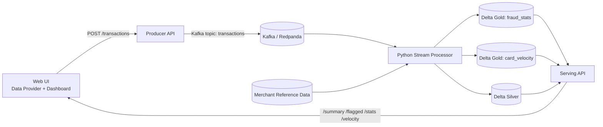
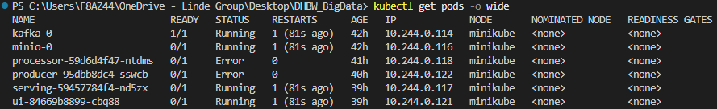
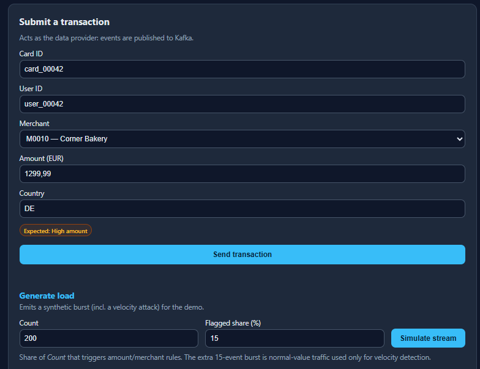
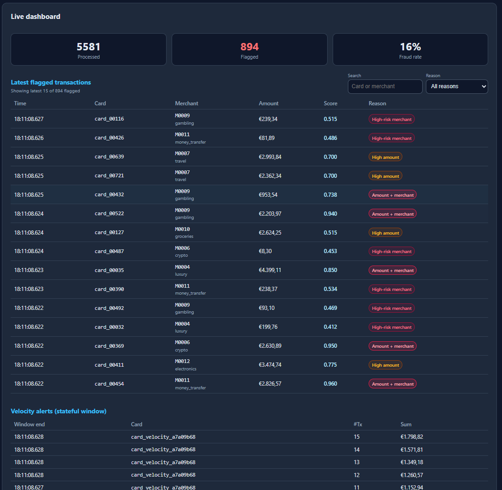
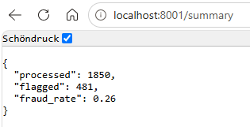
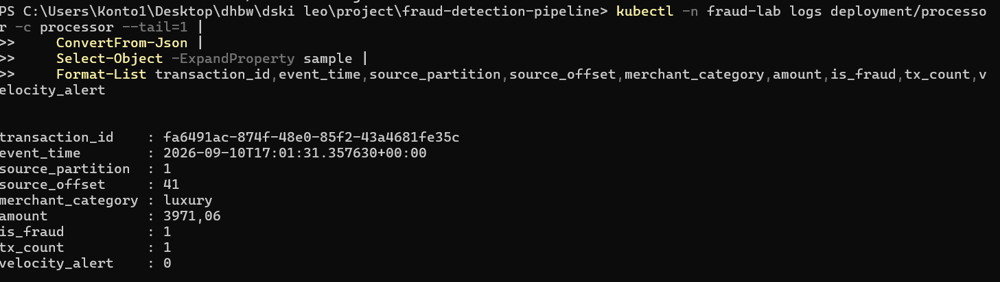
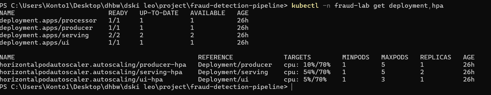

# Real-time Fraud Detection on Kubernetes (Kappa Architecture)

Course: Cloud Computing und Big Data - Pruefungsleistung 2026

This repository implements a data-driven streaming prototype for fraud detection in card payments.
The system is deployed declaratively on Kubernetes and includes a real user-facing UI.

---

## 1. Use Case und Motivation

### Problem
Card payment providers need to detect suspicious behavior in near real time, for example:
- very high transaction amount,
- risky merchant categories,
- velocity attacks (many transactions from one card in a short time).

### Why this is a Big Data problem
- Continuous event stream (not static batch files).
- Time-sensitive decisions: delayed detection causes direct financial risk.
- Need for scalable processing and stateful window logic.

### Data source
- Primary source: synthetic payment events generated by the producer service and UI.
- Enrichment source: merchant reference dataset with risk scores (`data/merchants.csv`).

---

## 2. Datencharakteristik (V's)

### Volume
The producer can generate large bursts (`POST /simulate`) and continuous streams.

### Velocity
Events arrive continuously and are processed in near real time by a long-running stream consumer.

### Variety
Data combines:
- transaction events (amount, card, merchant, geo, timestamp),
- merchant master data (category, country, risk score),
- derived features (fraud score, velocity alert, window aggregates).

---

## 3. Architekturentscheidung: Kappa vs. Lambda

### Decision
Kappa architecture was chosen (streaming-first).

### Rationale
- Single processing path reduces operational complexity.
- Avoids duplicated business logic across batch and speed layers.
- Fits the prototype objective: coherent end-to-end streaming data flow.

### Architecture diagram



---

## 4. Komponenten und Datenfluss

### Components
- `producer` (FastAPI): ingestion edge, receives UI events and publishes to Kafka.
- `kafka` (Redpanda single-node): event log for streaming ingestion.
- `processor` (Python + kafka-python-ng + deltalake): ingestion, enrichment, fraud scoring, per-card state/window processing.
- `minio` (S3-compatible object storage): data lake/lakehouse storage.
- `serving` (FastAPI + delta-rs): query layer for dashboard/API consumers.
- `ui` (nginx static app): user-facing interaction and live monitoring.

### End-to-end data flow
1. User submits transaction in UI (or triggers synthetic burst generation).
2. Producer writes event to Kafka topic `transactions`.
3. Processor consumes topic records, parses event-time, and enriches with merchant risk metadata.
4. Processor computes fraud signals and writes Silver records to Delta on MinIO.
5. Processor computes Gold aggregates for dashboard and velocity alerts.
6. Serving API reads Silver/Gold and exposes query endpoints.
7. UI receives live dashboard updates via SSE stream, with polling fallback for resilience.

---

## 5. Processing-Logik (Transformationen, Windowing/State, Late Data)

### Non-trivial transformations
- Merchant enrichment: transactions are enriched with merchant risk reference data.
- Rule-based feature engineering:
    - `amount_flag` (high-value threshold),
    - `merchant_flag` (high-risk merchant threshold),
    - composite `fraud_score`,
    - final `is_fraud` classification.

### Windowing and state
- Gold `card_velocity`: sliding event-time window behavior with count/sum/max metrics per card.
- Velocity alert flag if tx count in window exceeds configured threshold.
- Stateful logic is kept per-card in memory using deques and event-time pruning.

### Late data handling
- Event-time is parsed from incoming payload (`event_time`) and used for state pruning.
- Out-of-order or malformed timestamps fall back to current UTC time to keep processing stable.

---

## 6. Speicherkonzept (Format, Partitionierung, Schema)

### Format
- Delta Lake tables (Parquet data files plus a `_delta_log` transaction log) on MinIO (S3 object storage), not HDFS.
- Delta is chosen over plain Parquet because it adds ACID commits, consistent snapshots, versioned history and schema evolution on cheap object storage (the Lakehouse idea from the lecture).

### Partitioning
- The `silver/transactions` fact table is partitioned by `ingest_date` (event date).
- Rationale: fraud events are time-series data, so date partitioning enables date-range pruning, cheap retention/rollover of old days, and keeps each write's file set small.
- The Gold tables (`fraud_stats`, `card_velocity`) are intentionally left unpartitioned: they are small aggregate outputs that the serving layer scans in full for the dashboard.

### Schema
- Silver carries an explicit, typed schema: identifiers (`transaction_id`, `card_id`, `user_id`, `merchant_id`), event/ingest time, enrichment (`merchant_category`, `merchant_country`, `merchant_risk`), raw fields (`amount`, `currency`, `lat`, `lon`, `country`) and derived signals (`amount_flag`, `merchant_flag`, `fraud_score`, `is_fraud`).
- Writes use `schema_mode="merge"` (delta-rs), so new columns can be added without breaking existing readers (schema evolution).

### Why Data Lake / Lakehouse (not a warehouse)
- Schema-on-read friendly, ACID transaction log, versioned history and separation of compute and storage on low-cost object storage.

---

## 7. User-facing UI

### Role
- Data supplier: form submits real transactions into ingestion pipeline.
- Result consumer: dashboard displays summary, flagged transactions, velocity alerts.

### Real pipeline coupling
- UI sends data to producer API (`/api/producer/*` proxied by nginx).
- UI reads serving output (`/api/serving/*`).
- No mock data in dashboard path.

### User flow
1. Open UI service.
2. Submit manual transaction or generate synthetic event burst.
3. Observe updated flagged metrics and velocity alerts in dashboard tables.

---

## 8. Kubernetes Deployment

Deployment is declarative via Helm chart:

- Chart path: `deploy/helm/fraud-pipeline`
- Workload types:
    - `StatefulSet`: Kafka (Redpanda), MinIO
    - `Deployment`: producer, processor, serving, UI
- Config and secrets:
    - `ConfigMap`: pipeline parameters, Kafka/S3 endpoints, merchant CSV
    - `Secret`: MinIO/S3 credentials
- Persistence:
    - PVC through `volumeClaimTemplates` for Kafka and MinIO
- Scalability:
    - HPA for producer and serving (CPU metrics)
    - Optional KEDA `ScaledObject` for processor based on Kafka lag

---

## 9. Deployment-Anleitung (reproducible)

### Prerequisites
- Kubernetes cluster (Minikube/k3d or university environment)
- Helm v3+
- Docker images for all services available in registry
- Metrics server for HPA targets
- KEDA operator only if `keda.enabled=true`

### Build/publish container images (example)
```bash
docker build -t local/fraud-producer:dev services/producer
docker build -t local/fraud-processor:dev services/processor
docker build -t local/fraud-serving:dev services/serving
docker build -t local/fraud-ui:dev services/ui
minikube image load local/fraud-producer:dev
minikube image load local/fraud-processor:dev
minikube image load local/fraud-serving:dev
minikube image load local/fraud-ui:dev
```

### Install
```bash
helm upgrade --install fraud-pipeline deploy/helm/fraud-pipeline \
    --set images.producer=local/fraud-producer:dev \
    --set images.processor=local/fraud-processor:dev \
    --set images.serving=local/fraud-serving:dev \
    --set images.ui=local/fraud-ui:dev \
    --set global.imagePullPolicy=IfNotPresent \
    --set keda.enabled=false
kubectl get pods
kubectl get svc
```

### Access UI (example)
```bash
kubectl port-forward svc/ui 8080:8080
```
Then open `http://localhost:8080`.

---

## 10. Wesentliche Codeabschnitte (mit Verlinkung)

- Ingestion edge and simulation:
    - [Transaction ingest endpoint](services/producer/app.py#L123)
    - [Synthetic stream endpoint](services/producer/app.py#L178)
    - Accepts UI transactions and writes to Kafka, supports synthetic burst generation.

- Stream processing pipeline:
    - [Main consumer loop](services/processor/app.py#L95)
    - [Stateful velocity rule](services/processor/app.py#L156)
    - [Delta write flush](services/processor/app.py#L207)
    - Kafka consume loop, merchant enrichment, fraud scoring, stateful card-velocity detection, Silver/Gold Delta writes.

- Serving/query layer:
    - [Summary endpoint](services/serving/app.py#L88)
    - [SSE stream endpoint](services/serving/app.py#L170)
    - Reads Delta tables and exposes summary/flagged/velocity/stats endpoints.

- UI integration:
    - [Form wiring and submit trigger](services/ui/html/app.js#L189)
    - [Event-driven stream connection](services/ui/html/app.js#L157)
    - [Dashboard rendering function](services/ui/html/app.js#L118)
    - Transaction form + live dashboard wired to real APIs.

- Kubernetes manifests and deployment logic:
    - [All Deployments and Services](deploy/helm/fraud-pipeline/templates/apps.yaml#L1)
    - [Kafka StatefulSet](deploy/helm/fraud-pipeline/templates/kafka.yaml#L1)
    - [MinIO StatefulSet + bootstrap job](deploy/helm/fraud-pipeline/templates/minio.yaml#L1)
    - [HPA manifests](deploy/helm/fraud-pipeline/templates/hpa.yaml#L1)
    - [Optional KEDA ScaledObject](deploy/helm/fraud-pipeline/templates/keda.yaml#L1)

---

## 11. Screenshots und Nachweise

Place evidence files in `docs/screenshots/` and embed below.

Required evidence:
- UI in operation (transaction submit + dashboard)
- `kubectl get pods`
- Serving API output (`/summary`, `/flagged`, or `/stats`)
- Pipeline output examples (processor/log or table snapshots)
- Scaling evidence (`kubectl get hpa` and optionally KEDA state)

1. Cluster health: all core components are deployed and Running.



2. Data-provider UI action: synthetic events are generated and accepted by the producer.



3. Live dashboard result view: processed/flagged metrics plus fraud and velocity tables.



4. Serving API response: query endpoint returns live aggregated results.



5. Processing evidence: processor writes streaming batches to Delta tables.



6. Horizontal scaling evidence: HPA resources are present and active.



---

## 12. Grenzen des Prototyps und Ausblick

### Current prototype limits
- Fraud logic is rule-based (no ML model yet).
- Single-region setup, no cross-cluster disaster recovery.
- Security hardening is simplified for lab/prototype usage.
- KEDA requires operator pre-installation in the target cluster and is optional for local runs.
- Stateful infrastructure (single-node Redpanda and MinIO) is intentionally kept minimal for lab reproducibility; horizontal scaling is demonstrated on stateless services (producer/serving) and optionally processor via KEDA.
- Late-data treatment is pragmatic (event-time parsing with fallback behavior), not a full watermark-based production strategy.

### Next steps
- Add model-based scoring (feature store + online inference).
- Add schema registry and strict data contracts.
- Add end-to-end integration tests in CI.
- Add SLO dashboards and observability stack (Prometheus/Grafana).

### Team contribution (Eigenanteil)

The group has two members. Work was split by coherent subsystems of comparable
complexity, and the overall contribution of both members is considered equal (50/50).

**Valentyn Mukhanov — Ingestion, Processing & Storage (data path)**
- Producer / ingestion service: FastAPI edge, Kafka producer, synthetic stream
  generation and velocity-attack simulation ([services/producer/app.py](services/producer/app.py)).
- Stream processor: Kafka consumption, merchant enrichment join, fraud scoring,
  stateful per-card velocity windows and Delta writes
  ([services/processor/app.py](services/processor/app.py)).
- Storage concept: Delta Lake on MinIO, `ingest_date` partitioning and schema design.

**Veniamin Nekhoda — Serving, UI & Kubernetes (delivery path)**
- Serving/query layer: delta-rs endpoints and the event-driven SSE stream
  ([services/serving/app.py](services/serving/app.py)).
- User-facing UI: data-provider form and live dashboard wired to the real APIs
  ([services/ui/html/app.js](services/ui/html/app.js)).
- Kubernetes deployment: Helm chart, ConfigMap/Secret/PVC, HPA/KEDA autoscaling
  and the CI pipeline ([deploy/helm/fraud-pipeline](deploy/helm/fraud-pipeline)).

**Shared**
- Architecture decision (Kappa), README report and end-to-end testing were done jointly.
- Development followed small, logical commits, so the Git history reflects the
  iterative, per-feature implementation of both members.

---

## Bonus justification (explicit)

This project targets the bonus criteria with explicit rationale:
- Justified technology deviation: MinIO/S3 object storage instead of HDFS.
- Challenging use case: real-time financial fraud detection with stateful velocity logic.
- Beyond minimum requirements:
    - robust stream processing with event-time state and continuous Delta writes,
    - schema evolution support,
    - autoscaling via HPA + KEDA,
    - CI pipeline (syntax, Helm render, Docker build).
