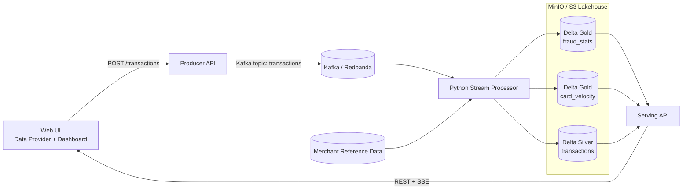

# Real-time Fraud Detection on Kubernetes (Kappa Architecture)

Course: Cloud Computing und Big Data - Pruefungsleistung 2026

This repository implements a data-driven streaming prototype for fraud detection in card payments.
The system is deployed declaratively on Kubernetes and includes a real user-facing UI.

---

## 1. Use Case und Motivation

### Problem
Card payment providers must identify suspicious behavior while a payment stream is still active, for example:
- very high transaction amount,
- risky merchant categories,
- velocity attacks (many transactions from one card in a short time).

The prototype produces a risk signal for review; it does not automatically block a real payment.

### Why this is a Big Data problem
- Payments form a continuous, unbounded stream rather than a finite batch file.
- Detection is time-sensitive: a velocity attack is only useful to detect while the rapid sequence is happening.
- Per-card history must be maintained while many cards are processed concurrently; this requires partitioned ingestion, stateful processing and scalable storage.

### Data source
- Primary source: reproducible synthetic JSON payment events generated by the producer service or submitted manually through the UI. `POST /simulate` accepts up to 100,000 events per request and can inject a controlled fraud ratio and a velocity burst.
- Enrichment source: the versioned merchant reference dataset [data/merchants.csv](data/merchants.csv), containing category, country and a normalized risk score.
- Synthetic data was chosen because no real cardholder data is needed for grading and no personal payment data is exposed.

---

## 2. Datencharakteristik (V's)

### Volume
The production scenario is a payment platform handling thousands of transactions per second. As an illustrative design point, 5,000 events/s corresponds to 432 million events/day (roughly 216 GB/day at 500 bytes/event before replication). The prototype runs at laptop scale but its generator, Kafka partitions and stateless services allow load to be increased without changing the data model.

### Velocity
Events are produced continuously and fraud decisions must be fresh. The processor flushes either after 25 records or after one second, whichever occurs first; the serving layer then pushes changed dashboard data through SSE.

### Variety
Data combines:
- semi-structured JSON transaction events (amount, card, merchant, geo, event-time),
- structured CSV merchant master data (category, country, risk score),
- typed Delta records and derived features (fraud score, late-data flags, velocity and category aggregates).

### Veracity and Value
- Pydantic validates UI/API input; malformed event-time is marked and logged instead of silently disappearing.
- Merchant enrichment and stateful rules turn low-level events into reviewable fraud signals, which is the business value of the pipeline.

---

## 3. Architekturentscheidung: Kappa vs. Lambda

### Decision
Kappa architecture was chosen (streaming-first).

### Rationale
- Kafka/Redpanda is the ordered, replayable event log and the single ingestion path.
- Silver/Gold tables are derived views; the same processor handles live records and replay after using a new consumer group or resetting offsets (`auto_offset_reset="earliest"` applies when no committed offset exists).
- Lambda would require separate batch and speed implementations for the same fraud rules, increasing maintenance and risking inconsistent results.
- The use case is stream-first and does not require a separate periodic batch result, so Kappa is the simpler coherent choice.

### Architecture diagram



---

## 4. Komponenten und Datenfluss

### Components and technology choices

| Component | Technology | Why it was chosen |
| --- | --- | --- |
| `producer` | FastAPI + `kafka-python-ng` | Pydantic validates incoming events; the lightweight HTTP service is stateless and horizontally scalable. Kafka messages are keyed by `card_id` to preserve per-card order. |
| `kafka` | Redpanda (Kafka-compatible) | Provides an ordered, retained log, consumer groups and replay semantics required by Kappa, while remaining simple to run as one lab container. The `transactions` topic is created with six partitions for parallel consumers. |
| `processor` | Python + `kafka-python-ng` + delta-rs | An intentionally alternative streaming engine: transparent state/window code, low runtime overhead and direct Delta writes without a separate JVM cluster. This deviation is allowed by the assignment and its limitations are stated in section 12. |
| `minio` | S3-compatible object storage | Separates durable storage from compute, is Kubernetes-friendly and represents the cloud-object-storage alternative to HDFS discussed in the lecture. |
| Silver/Gold tables | Delta Lake | Adds atomic commits, schema evolution and versioned table history to Parquet files on object storage. |
| `serving` | FastAPI + delta-rs | Reads Delta without Spark and remains stateless; REST supports direct queries and SSE pushes changed dashboard snapshots. |
| `ui` | HTML/JavaScript served by nginx | A separately containerized, low-overhead web component. nginx provides same-origin reverse proxies to producer and serving, including unbuffered SSE. |

### End-to-end data flow
1. User submits transaction in UI (or triggers synthetic burst generation).
2. Producer writes event to Kafka topic `transactions`.
3. Processor consumes topic records, parses event-time, and enriches with merchant risk metadata.
4. Processor computes fraud signals and writes Silver records to Delta on MinIO.
5. Processor computes Gold aggregates for dashboard and velocity alerts.
6. Serving API reads Silver/Gold and exposes query endpoints.
7. UI receives live dashboard updates via SSE stream, with polling fallback for resilience.

---

## 5. Processing-Logik (Transformationen, Windowing/State, Late Data)

### Non-trivial transformations
- Merchant enrichment join: `merchant_id` enriches every transaction with category, country and normalized merchant risk.
- Rule-based feature engineering:
    - `amount_flag = 1` when amount is above EUR 800,
    - `merchant_flag = 1` when merchant risk is at least 0.7,
    - `is_fraud = amount_flag OR merchant_flag` for an explainable review rule.

The score combines equal maximum contributions from amount and merchant risk:

$$
fraud\_score = 0.5 \cdot \min\left(\frac{amount}{2 \cdot 800}, 1\right)
              + 0.5 \cdot merchant\_risk
$$

Equal weights avoid pretending that the synthetic data supports a learned calibration. The amount contribution reaches its cap at twice the high-amount threshold; merchant risk is already normalized to $[0,1]$.

The prototype thresholds are deliberately explainable and matched to the synthetic source: ordinary generated purchases are EUR 1-250, whereas suspicious samples start at EUR 800; merchant scores at or above 0.7 represent the high-risk reference categories. More than 10 operations in 60 seconds models a card-testing/velocity burst while remaining easy to demonstrate. The 120-second lateness allowance is twice the window length, balancing disorder tolerance against bounded in-memory state.

### Windowing and state
- For an event at time $t$, Gold `card_velocity` evaluates the per-card sliding interval $[t-60s,t]$.
- The state stores `(event_time, amount, fraud_score)` and computes transaction count, cumulative amount and maximum score across the actual window; an alert is raised above 10 transactions.
- Kafka partitioning by `card_id` keeps a card's ordered events in one consumer. Deques are pruned after the window plus allowed-lateness horizon to bound memory.
- Gold `fraud_stats` keeps one-minute tumbling aggregates per merchant category (`total`, `flagged`, average score). The serving endpoint selects the latest snapshot for every window/category.

### Late data handling
- Event-time comes from `event_time`, not ingestion time. Out-of-order records up to 120 seconds behind the newest event for a card are accepted into state.
- Older records remain in Silver for auditability but are marked `velocity_excluded=1` and do not rewrite already emitted Gold windows.
- Missing or malformed timestamps use current UTC, are logged, and carry `event_time_fallback=1`; all out-of-order records carry `is_late=1`.

### Delivery and failure semantics
- Producer sends use `acks="all"` and retries.
- Kafka auto-commit is disabled. Consumer offsets are committed only after Silver and both Gold writes succeed, providing at-least-once processing.
- A crash after Delta commit but before Kafka offset commit can replay a record, so duplicates remain possible; exactly-once across three independent Delta tables is explicitly outside the prototype scope.

---

## 6. Speicherkonzept (Format, Partitionierung, Schema)

### Format
- Delta Lake tables (Parquet data files plus a `_delta_log` transaction log) on MinIO (S3 object storage), not HDFS.
- Delta is chosen over plain Parquet because it adds ACID commits, consistent snapshots, versioned history and schema evolution on cheap object storage (the Lakehouse idea from the lecture).

### Partitioning
- The `silver/transactions` fact table is partitioned by `event_date` derived from event-time.
- Rationale: fraud events are time-series data, so date partitioning enables date-range pruning, cheap retention/rollover of old days, and keeps each write's file set small.
- The Gold tables (`fraud_stats`, `card_velocity`) are intentionally left unpartitioned for the compact prototype dataset because the dashboard scans them as a whole. At production retention volumes they would be partitioned by window date as well.

### Schema
- Silver carries an explicit, typed schema: identifiers (`transaction_id`, `card_id`, `user_id`, `merchant_id`), event/ingest time, enrichment (`merchant_category`, `merchant_country`, `merchant_risk`), raw fields (`amount`, `currency`, `lat`, `lon`, `country`), derived signals and late-data flags.
- `card_velocity` contains window boundaries, card, count, amount sum, maximum score and alert/exclusion flags. `fraud_stats` contains fixed window boundaries, category, total/flagged counts, average score and snapshot update time.
- Writes use `schema_mode="merge"` (delta-rs), so new columns can be added without breaking existing readers (schema evolution).

### Why Data Lake / Lakehouse (not a warehouse)
- The event model evolves more naturally than a rigid warehouse schema, while Delta still provides table schema, ACID commits and versioned history. Compute services remain replaceable and separate from low-cost object storage.
- No separate Bronze table is written: in this Kappa prototype the retained Kafka log is the raw replay source, while Silver and Gold are persistent derived views.

---

## 7. User-facing UI

### Role
- Data supplier: form submits real transactions into ingestion pipeline.
- Result consumer: dashboard displays summary, flagged transactions, velocity alerts.

### Real pipeline coupling
- UI sends data to producer API (`/api/producer/*` proxied by nginx).
- UI reads serving output (`/api/serving/*`) and keeps an SSE connection for changed dashboard snapshots; a three-second polling fallback is used only if SSE fails.
- No mock data in dashboard path.

### User flow
1. Open UI service.
2. Submit one manual payment, or choose count/fraud ratio and generate a paced synthetic stream including one same-card burst.
3. The producer confirms acceptance; after processing, summary values and the flagged/velocity tables update without a page reload.

---

## 8. Kubernetes Deployment

Deployment is declarative via the Helm chart [deploy/helm/fraud-pipeline](deploy/helm/fraud-pipeline).

| Component | Kubernetes resource | Reason |
| --- | --- | --- |
| Redpanda | `StatefulSet` + PVC | Stable broker identity and durable Kafka log across pod restarts. |
| MinIO | `StatefulSet` + PVC | Stable object-store identity and durable Delta files. |
| Bucket bootstrap | Helm post-install/post-upgrade `Job` | Waits for MinIO and idempotently creates the lake bucket. |
| Producer, processor, serving, UI | `Deployment` | Replaceable application pods with declarative rolling updates. |
| Producer, serving and UI | `HorizontalPodAutoscaler` | All three are stateless; CPU requests make utilization-based HPA measurable. |
| Processor (optional) | KEDA `ScaledObject` | Kafka-lag signal, bounded by the six topic partitions; disabled by default because the KEDA operator is an external prerequisite. |

- `pipeline-config` contains endpoints and processing thresholds; `merchants-data` mounts the reference CSV. Credentials are separated into `pipeline-secrets` and injected at runtime rather than baked into images.
- Every long-running workload has CPU/memory requests and limits plus readiness/liveness checks. HPA scales producer/serving from 1 to 5 replicas and UI from 1 to 3.
- Redpanda and MinIO use PVCs from `volumeClaimTemplates`. Producer and processor initContainers idempotently create or expand `transactions` to six partitions before the applications start.
- Scale path by component: stateless Deployments use HPA; processor parallelism is capped by Kafka partitions and can use KEDA; production Redpanda would use a multi-broker StatefulSet/operator and production MinIO distributed mode. Those two stateful production topologies are intentionally not simulated on one laptop.

---

## 9. Deployment-Anleitung (reproducible)

### Prerequisites
- Docker
- Kubernetes cluster (Minikube/k3d or university environment) and `kubectl`
- Helm v3+
- Metrics Server for live HPA CPU values (`minikube addons enable metrics-server` on Minikube)
- KEDA operator only when the optional `keda.enabled=true` mode is used

### Build and load container images (tested Minikube path)
```bash
docker build -t local/fraud-producer:dev services/producer
docker build -t local/fraud-processor:dev services/processor
docker build -t local/fraud-serving:dev services/serving
docker build -t local/fraud-ui:dev services/ui
minikube image load local/fraud-producer:dev
minikube image load local/fraud-processor:dev
minikube image load local/fraud-serving:dev
minikube image load local/fraud-ui:dev
```

For k3d, replace `minikube image load` with `k3d image import`. For a remote cluster, push the four images to an accessible registry and override `images.*` in Helm values.

### Install
```bash
helm upgrade --install fraud-pipeline deploy/helm/fraud-pipeline \
    --set images.producer=local/fraud-producer:dev \
    --set images.processor=local/fraud-processor:dev \
    --set images.serving=local/fraud-serving:dev \
    --set images.ui=local/fraud-ui:dev \
    --set global.imagePullPolicy=IfNotPresent \
    --set keda.enabled=false
kubectl get pods
kubectl get svc
```

Wait until the application is ready:

```bash
kubectl wait --for=condition=ready pod --all --timeout=300s
kubectl get hpa
```

### Access UI (example)
```bash
kubectl port-forward svc/ui 8080:8080
```
Then open `http://localhost:8080`.

### Create the submission ZIP

After committing the final evidence, create a self-contained archive directly from Git:

```bash
git archive --format=zip --output=fraud-detection-pipeline.zip HEAD
```

---

## 10. Wesentliche Codeabschnitte (mit Verlinkung)

- Ingestion edge and simulation:
    - [Transaction ingest endpoint](services/producer/app.py#L123)
    - [Synthetic stream endpoint](services/producer/app.py#L178)
    - Accepts UI transactions and writes to Kafka, supports synthetic burst generation.

- Stream processing pipeline:
  - [Fraud signal calculation](services/processor/app.py#L97)
  - [Delta write and offset commit](services/processor/app.py#L113)
  - [Kafka polling loop](services/processor/app.py#L172)
  - [Late-data classification](services/processor/app.py#L202)
  - [Stateful velocity window](services/processor/app.py#L216)
    - Kafka consume loop, merchant enrichment, fraud scoring, stateful card-velocity detection, Silver/Gold Delta writes.

- Serving/query layer:
    - [Summary endpoint](services/serving/app.py#L88)
  - [Latest category aggregates](services/serving/app.py#L163)
  - [SSE stream endpoint](services/serving/app.py#L178)
    - Reads Delta tables and exposes summary/flagged/velocity/stats endpoints.

- UI integration:
  - [Form wiring and submit trigger](services/ui/html/app.js#L199)
  - [SSE stream connection](services/ui/html/app.js#L161)
  - [Dashboard rendering function](services/ui/html/app.js#L122)
    - Transaction form + live dashboard wired to real APIs.

- Kubernetes manifests and deployment logic:
    - [All Deployments and Services](deploy/helm/fraud-pipeline/templates/apps.yaml#L1)
    - [Kafka StatefulSet](deploy/helm/fraud-pipeline/templates/kafka.yaml#L1)
    - [MinIO StatefulSet + bootstrap job](deploy/helm/fraud-pipeline/templates/minio.yaml#L1)
    - [HPA manifests](deploy/helm/fraud-pipeline/templates/hpa.yaml#L1)
    - [Optional KEDA ScaledObject](deploy/helm/fraud-pipeline/templates/keda.yaml#L1)

---

## 11. Screenshots und Nachweise

The following evidence was captured from the locally deployed Minikube release. The image files are included under [docs/screenshots](docs/screenshots), so the ZIP remains self-contained.

1. Cluster health: all core components are deployed and Running.


2. Data-provider UI action: synthetic events are generated and accepted by the producer.


3. Live dashboard result view: processed/flagged metrics plus fraud and velocity tables.


4. Serving API response: query endpoint returns live aggregated results.


5. Processing evidence: processor writes streaming batches to Delta tables.


6. Horizontal scaling evidence: HPA resources are present and active.


---

## 12. Grenzen des Prototyps und Ausblick

### Current prototype limits
- Fraud logic is rule-based (no ML model yet).
- Single-region setup, no cross-cluster disaster recovery.
- Default MinIO credentials, plaintext in-cluster traffic and permissive CORS are acceptable only for this isolated lab; production requires managed secrets, TLS, authentication and network policies.
- KEDA requires operator pre-installation in the target cluster and is optional for local runs.
- Stateful infrastructure (single-node Redpanda and MinIO) is intentionally minimal for laptop reproducibility. Horizontal scaling is demonstrated on the stateless producer, serving and UI deployments.
- Processor KEDA scaling is technically bounded by six partitions, but its in-memory window state is not transferred during consumer-group rebalancing; a production version would use a framework with checkpointed/distributed state (for example Flink) or an external state store.
- Late records inside the 120-second allowance affect their own calculation, but append-only Gold snapshots already emitted for later event-times are not revised.
- Processing is at-least-once, not exactly-once across all three Delta tables; replay duplicates are possible around a crash boundary.
- Kafka retention is finite (seven days in the lab broker defaults); there is no separate long-term raw/Bronze archive.
- Serving reads compact Delta tables directly for simplicity. A production dataset would require a query engine, incremental cache or materialized serving store rather than repeated full-table scans.

### Next steps
- Add model-based scoring (feature store + online inference).
- Add schema registry and strict data contracts.
- Add deduplication/upsert by `transaction_id` and checkpointed state for fully recoverable scale-out.
- Add end-to-end integration tests in CI (current CI covers syntax, processor rule tests, both Helm modes and image builds).
- Add SLO dashboards and observability stack (Prometheus/Grafana).

### Team contribution (Eigenanteil)

The group has two members. Work was split by coherent subsystems of comparable
complexity, and the overall contribution of both members is considered equal (50/50).

**Valentyn Mukhanov — Ingestion, Processing & Storage (data path)**
- Producer / ingestion service: FastAPI edge, Kafka producer, synthetic stream
  generation and velocity-attack simulation ([services/producer/app.py](services/producer/app.py)).
- Stream processor: Kafka consumption, merchant enrichment join, fraud scoring,
  stateful per-card velocity windows and Delta writes
  ([services/processor/app.py](services/processor/app.py)).
- Storage concept: Delta Lake on MinIO, `event_date` partitioning and schema design.

**Veniamin Nekhoda — Serving, UI & Kubernetes (delivery path)**
- Serving/query layer: delta-rs endpoints and the event-driven SSE stream
  ([services/serving/app.py](services/serving/app.py)).
- User-facing UI: data-provider form and live dashboard wired to the real APIs
  ([services/ui/html/app.js](services/ui/html/app.js)).
- Kubernetes deployment: Helm chart, ConfigMap/Secret/PVC, HPA/KEDA autoscaling
  and the CI pipeline ([deploy/helm/fraud-pipeline](deploy/helm/fraud-pipeline)).

**Shared**
- Architecture decision (Kappa), README report and end-to-end testing were done jointly.
- Development followed small, logical feature commits. Final integration was performed on one work laptop under Valentyn's Git identity (`AnDOnE12345`), so commit authorship does not represent the 50/50 contribution split; ownership is documented explicitly above rather than retroactively rewriting history.

---

## Bonus justification (explicit)

This project targets the bonus criteria with explicit rationale:
- Justified technology deviation: MinIO/S3 instead of HDFS separates storage from compute and maps to cloud object-storage practice; the Python processor makes event-time state explicit without operating a JVM cluster.
- Challenging use case: payment fraud combines enrichment, explainable scoring, per-key state, event-time windows and late records rather than a stateless map/filter pipeline.
- Beyond minimum requirements:
    - schema evolution plus date-partitioned Delta storage,
    - HPA with resource metrics and optional Kafka-lag KEDA configuration,
    - event-driven SSE dashboard with polling fallback,
    - CI pipeline for Python syntax, processor rule tests, default/KEDA Helm rendering and all Docker builds.
