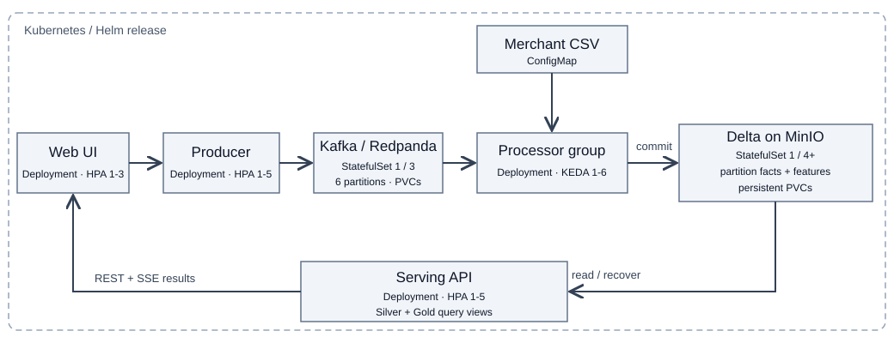
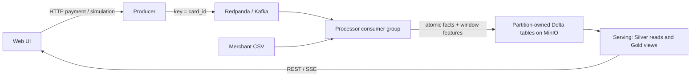
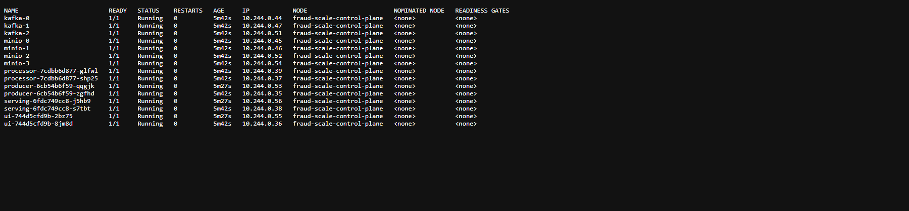
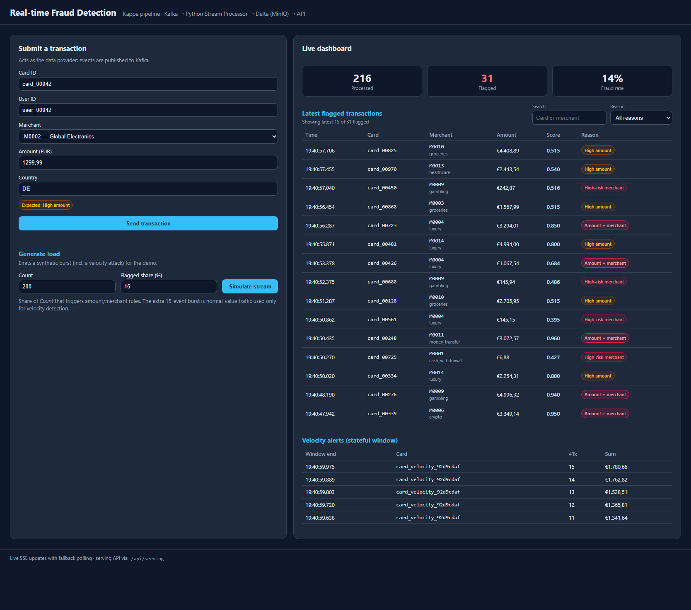
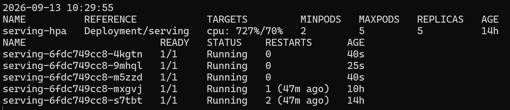

# Real-time Fraud Detection on Kubernetes

Course: Cloud Computing und Big Data - Pruefungsleistung 2026

This prototype implements a Kappa payment-event pipeline with a separately deployed web UI.
The current v2 implementation fixes recovery and cross-processor aggregation. Python tests and
the local Kubernetes deployment have been checked; section 11 includes current UI, API, pod,
processing-output, distributed-scaling, restart-recovery and late-data evidence.

## 1. Use Case und Motivation

Payment providers need to identify high-value purchases, risky merchants and repeated attempts
from one card while payments are arriving. This prototype produces explainable review signals;
it does not block real payments or claim to estimate calibrated fraud probabilities.

The primary source is synthetic JSON from the producer API or a manual UI payment.
The enrichment source is [merchant reference data](data/merchants.csv): category, country and risk.
Synthetic data avoids personal cardholder data and makes specific scenarios easy to demonstrate.
The generator balances amount-only, merchant-only and combined flagged examples. An optional
15-payment same-card burst independently demonstrates velocity detection.

This is a Big Data use case because the input is an unbounded, time-sensitive event stream,
with history needed across many cards. Partitioned ingestion, durable storage and independent
compute services allow concurrency to grow. The implementation is a laptop-scale prototype.

## 2. Datencharakteristik

| V | Application |
| --- | --- |
| Volume | An illustrative production design point of 5,000 events/s implies 432 million/day, approximately 216 GB/day at 500 bytes/event before replication. These are design assumptions, not measured throughput. |
| Velocity | Kafka ingestion is continuous. The processor polls up to 25 events with a one-second timeout and writes each nonempty partition batch immediately. Storage latency adds to that delay. |
| Variety | JSON payments and CSV merchant data become typed Delta facts, window features and category query results. |
| Veracity | Pydantic validates API requests; invalid event-time is marked and uses the Kafka record timestamp for deterministic replay. |
| Value | Reviewers can distinguish amount, merchant-risk and rapid-repetition signals. |

## 3. Architekturentscheidung: Kappa vs. Lambda

Kappa is appropriate because live traffic and replay use the same Kafka topic and the same
enrichment/window code. A separate Lambda batch path would duplicate these rules. Kafka is the
retained raw log; Delta stores durable derived facts. There is no additional Bronze copy.





Each Kafka partition has a separate Delta table. This separates writers while keeping stable
storage ownership when consumer-group assignments change. One atomic record contains the enriched
payment and velocity features. Gold `card_velocity` and `fraud_stats` are **query views over those
facts**, not independently committed tables. This removes partial commits across Silver/Gold and
process-local cumulative category snapshots that previously lost counts during scale-out.

Replay into an existing prefix skips Kafka offsets already present in Delta. To rebuild using
changed rules, use a **new storage prefix and a new consumer group**, then point serving at that
prefix after catch-up. Never delete existing tables to trigger replay. Only retained Kafka records
can be rebuilt; the broker retention and earliest available offsets bound recovery of raw history.

## 4. Komponenten und Datenfluss

| Component | Choice and rationale |
| --- | --- |
| Producer | FastAPI and kafka-python-ng validate input and publish messages keyed by card. It checks the returned Kafka Future before reporting acceptance. |
| Kafka | Redpanda provides the replayable Kafka log with six partitions. The scale profile uses three brokers with unique identities, RPC addresses and a shared seed. |
| Processor | Python + delta-rs keep enrichment and window calculations visible without a JVM cluster. State is recoverable from persisted partition facts. |
| Storage | MinIO provides S3-compatible object storage and separates compute from persistent data; Delta adds typed Parquet, atomic table commits and version history. |
| Serving | FastAPI reads partition tables, deduplicates Kafka coordinates and computes Gold category aggregates across every partition. The version-aware cache avoids rereading unchanged facts for SSE clients. |
| UI | HTML/JavaScript in a separate nginx container submits events and displays real serving output, using same-origin reverse proxies. |

The end-to-end path is UI → producer acknowledgement → Kafka → merchant enrichment and window
features → atomic Delta write → serving queries → UI update. A successful enqueue acknowledgement
does not mean the processor has already finished; downstream visibility follows the Delta commit.

## 5. Processing-Logik

### Transformations and rules

Merchant enrichment joins each `merchant_id` to the CSV. Amount above EUR 800 or merchant risk
at least 0.7 flags a payment. The severity score is:

`0.5 * min(amount / 1600, 1) + 0.5 * merchant_risk`

This score ranks signals and is not a learned probability or the binary decision threshold.
The thresholds are explainable prototype choices: normal synthetic purchases are EUR 1–250,
high-amount examples start at EUR 900, and more than ten payments in a minute models card testing.
The generator's requested flagged ratio applies to base events, excluding the velocity-only burst.

### Window state and recovery

For each payment at event-time `t`, the processor calculates count, amount sum and maximum score
in the same-card interval `[t-60s, t]`. A count above ten emits a velocity alert. This interval is
evaluated against accepted events observed so far; already emitted velocity results are not revised
when later arrivals have older timestamps.

State is keyed by card **within its Kafka partition**. The partition's maximum event-time acts as
a watermark: events older than maximum minus 120 seconds are excluded from velocity and category
views, but remain in Silver with `velocity_excluded=1`. `is_late` means older than that partition
maximum. The same rule applies to new and previously seen cards. Cleanup uses the same watermark
and removes inactive keys outside the 60+120 second horizon. Memory is bounded by accepted events
inside that horizon, not by a fixed event count; a burst within the horizon can still be large.

On assignment or restart, `recover()` reads the partition's durable facts, deduplicates source
coordinates and reconstructs the maximum event-time and retained card history. Already stored
offsets are skipped. This includes the case where Delta succeeded but Kafka offset commit did not.
Kafka offsets are committed only after the atomic Delta write. Ordinary restarts and rebalances
therefore preserve the eleventh-payment alert instead of resetting its counter.

### Category windows and late data

Each event stores its fixed one-minute window boundaries. `/stats` groups accepted, deduplicated
facts by window and merchant category, sums flags and computes the mean score across **all**
partitions. There is no last-snapshot-wins selection. Late arrivals cannot replace an old complete
aggregate with `total=1`; accepted late records contribute normally and too-late records are excluded.

Missing/invalid timestamps and timestamps more than five minutes ahead of the Kafka record time use
that deterministic Kafka timestamp and set `event_time_fallback=1`. The configurable
`MAX_FUTURE_SKEW_SECONDS` guard prevents one untrusted event from poisoning the partition watermark.
`POST /transactions` accepts an optional string `event_time` for late-data demonstrations.
Kafka coordinates `(source_topic, source_partition, source_offset)` identify replay duplicates;
two separately published payments with the same application transaction ID are not deduplicated.

### Delivery semantics

Producer uses `acks=all`, five retries and one in-flight request per connection; each Future is
checked. Delta stores facts and features together, avoiding three independent output commits.
The MinIO backend uses conditional PUT rather than unsafe rename. Serving deduplicates coordinates.
The overall claim remains at-least-once, not a universal exactly-once guarantee under arbitrary
network partitions or overlapping stale consumer owners. The prototype has no external fencing
lease for such a split-brain scenario. Do not change topic partition count or recreate the topic
against the same prefix; use a new generation and replay so card ownership and offsets remain valid.

## 6. Speicherkonzept

Delta tables are stored under:

`s3://fraud/v2/silver/transactions/partition-<Kafka partition>/`

Each is date-partitioned by `event_date`. Table-per-Kafka-partition separates normal concurrent
writers; date partitioning supports future pruning and retention. Gold views use the same durable
records, making category aggregation independent of which processor wrote each event. There is
no separate persistent Gold table in v2.

The explicit [Arrow schema](services/processor/app.py) fixes strings, float64 values and int64
flags/offsets even when a batch contains null coordinates. Event/window times are UTC ISO-8601
strings intentionally, not native Arrow timestamps. `lat`, `lon`, `user_id`, `country` may be null;
the remaining schema fields are non-nullable. Writes permit a deliberately updated Arrow schema to
add nullable fields, but arbitrary input fields are not accepted and no live schema-evolution demo is
claimed. Semantic rule changes require a new prefix and replay, not just schema merge.

Delta was selected over plain Parquet for atomic commits and versioned snapshots. A Lakehouse
keeps object storage independent of replaceable processors/readers and supports evolving event
data without introducing a warehouse. The current serving and recovery paths read whole partition
tables at laptop scale; a production system would use filtered recovery/checkpoints, compaction
and an incremental query store. No production-scale benchmark is claimed.

## 7. User-facing UI

The UI is both data supplier and result consumer. A form sends `/api/producer/transactions`;
the generator sends `/api/producer/simulate`. nginx forwards these to the producer service.
The dashboard uses serving REST and SSE through `/api/serving/`; no mock data is used.

Open the UI, submit a payment or request a simulation, wait for processing, and inspect the updated
summary, flagged-payment reasons and velocity alerts. Search/filter operates on the latest 100
flagged records and displays up to 15, with the total flagged count stated separately. SSE has a
three-second polling fallback. Simulation returns a schedule immediately; estimated duration is
the pacing lower bound and does not include Kafka acknowledgement/processing latency.

## 8. Kubernetes-Deployment

The [Helm chart](deploy/helm/fraud-pipeline) declares all components, Services, configuration and PVCs.
Producer, processor, serving and UI use Deployments. Redpanda and MinIO use StatefulSets with
headless Services and persistent volumes. ConfigMaps contain endpoints, thresholds and merchant
data; a Secret supplies storage credentials. All main containers declare resources and probes.
Producer readiness checks Kafka topic partition metadata; each publication separately waits for
broker acknowledgement. Processor probes check recent poll progress.

| Component | Horizontal scale path |
| --- | --- |
| Producer / serving / UI | HPA; scale profile starts at two replicas for each. |
| Processor | Kafka consumer group, two replicas in scale profile without KEDA; optional KEDA up to six, bounded by fixed topic partitions. Assignment restores partition history. |
| Kafka | Three brokers in scale profile; unique pod DNS/node IDs and RPC seed configuration. New topics use replication factor three. |
| MinIO | Four servers in an erasure-coded pool in scale profile. Add complete pools with `minio.poolCount`, keeping servers-per-pool unchanged. |

MinIO uses `OnDelete` updates in distributed mode because every server must adopt the same pool
endpoint list. An expansion requires a coordinated pod restart after the Helm update, not changing
the size of an existing pool. Persistent PVCs must be retained. A standalone installation must not
be converted to distributed mode in place; use the fresh-namespace instructions below.

The scale topology was deployed and exercised end to end on 2026-09-12. Three Redpanda brokers,
four distributed MinIO servers, two processors and two replicas of every stateless service were
Ready simultaneously. The run processed 216 new events through the producer, Kafka, both processor
replicas, Delta/MinIO and the serving/UI layer. Section 11 contains the captured runtime evidence.
This proves the configured horizontal topology. A separate controlled CPU-load experiment also
verified the serving HPA scale-up and scale-down cycle in section 11.

## 9. Deployment-Anleitung

### Local quick start — Windows PowerShell

Install Docker Desktop, Minikube, kubectl and Helm v3, then open a new PowerShell terminal so
the commands are available in PATH. Start Docker Desktop with Linux containers and wait until
its engine is running. Run the commands below from the project root, containing `README.md`,
`services` and `deploy`. Run each step in order and resolve any error before continuing.

The local screenshots used 4 CPUs and 3000 MB for Minikube on an 8 GB Windows host. This is an
observed lab configuration, not a guaranteed minimum. Docker must expose at least the requested
resources; the distributed profile below needs a larger environment. This quick start creates
the local profile `minikube` and namespace `fraud-lab`. For an existing installation, use the
update instructions below instead of treating it as a fresh deployment.

Start the cluster and enable CPU metrics for HPA:

```powershell
minikube -p minikube start --driver=docker --cpus=4 --memory=3000
minikube -p minikube addons enable metrics-server
kubectl --context minikube get storageclass
```

The cluster needs a default StorageClass that can provision the Kafka and MinIO PVCs.
Build all four images from the current source and load them into this profile:

```powershell
docker build -t local/fraud-producer:dev services/producer
docker build -t local/fraud-processor:dev services/processor
docker build -t local/fraud-serving:dev services/serving
docker build -t local/fraud-ui:dev services/ui
minikube -p minikube image load local/fraud-producer:dev
minikube -p minikube image load local/fraud-processor:dev
minikube -p minikube image load local/fraud-serving:dev
minikube -p minikube image load local/fraud-ui:dev
```

Install the chart, wait for application readiness, and inspect the resulting resources:

```powershell
helm upgrade --install fraud-pipeline deploy/helm/fraud-pipeline --kube-context minikube --namespace fraud-lab --create-namespace
kubectl --context minikube -n fraud-lab wait --for=condition=ready pod --all --timeout=600s
kubectl --context minikube -n fraud-lab get pods
kubectl --context minikube -n fraud-lab get deployment,statefulset,hpa,pvc
```

Bucket creation is a Helm post-install/post-upgrade Job. Keep the separate readiness check above;
do not substitute Helm `--wait` for this installation sequence. All application pods should be
ready and the PVCs should be `Bound` before using the UI.

```powershell
kubectl --context minikube -n fraud-lab port-forward svc/ui 8080:8080
```

Open `http://localhost:8080`. Leave this terminal running while using the UI; port-forward does
not return to the prompt during normal operation. Use a second PowerShell terminal for other
commands. `Ctrl+C` stops forwarding, not the deployed services; rerun the same command to reconnect.
If the cluster was stopped, start it again with `minikube -p minikube start` first. Closing and
reopening a terminal does not require reinstalling the chart or rebuilding images.

Submit a payment and wait for `Accepted` and the dashboard update. For a visible flagged example,
use merchant M0002 and amount 1299.99. A simulation with Count 200 and Flagged share 15 schedules
215 events, including the extra 15-payment velocity burst. After processing, the dashboard and
`http://localhost:8080/api/serving/summary` should agree on the total and flagged counts.

If a pod is not ready or an API request fails, inspect its status and logs before retrying:

```powershell
kubectl --context minikube -n fraud-lab get events --sort-by=.lastTimestamp
kubectl --context minikube -n fraud-lab describe pod -l app=producer
kubectl --context minikube -n fraud-lab logs deployment/producer -c producer --tail=30
kubectl --context minikube -n fraud-lab logs deployment/processor -c processor --tail=10
```

Use the affected component's label/container for other services. Explicit `-c processor` or
`-c producer` selects the application container rather than its Kafka initialization container.

### Update an application image

Use a new image tag for each build. The following PowerShell example updates only producer in
the existing local release; use the same terminal for the variable and subsequent commands:

```powershell
$producerImage = 'local/fraud-producer:dev-' + (Get-Date -Format 'yyyyMMddHHmmss')
docker build -t $producerImage services/producer
minikube -p minikube image load $producerImage
helm upgrade fraud-pipeline deploy/helm/fraud-pipeline --kube-context minikube --namespace fraud-lab --reuse-values --set-string "images.producer=$producerImage"
kubectl --context minikube -n fraud-lab rollout status deployment/producer --timeout=600s
```

The changed tag updates the Deployment and starts new pods automatically. For another service,
change the build directory, image name, `images.<service>` key and Deployment name together.
For UI updates, reconnect port-forward if its selected pod terminates, then reload the page.
This update sequence assumes unchanged processing semantics. For a new processor image that
changes rule semantics, build/load it first, then apply its tag together with a new prefix/group
in the maintenance replay procedure below; do not deploy new rules against the existing prefix.

`--reuse-values` retains the release's existing Helm settings, such as image tags and scale/KEDA
configuration; it does not preserve arbitrary manual changes made with `kubectl`.
See [Helm upgrade options](https://helm.sh/docs/helm/helm_upgrade/).
The locally verified producer previously used `local/fraud-producer:readiness-fix`, applied with
`kubectl set image`; the command above records the newly built image in Helm so later upgrades
retain that choice. A fresh install must build the current source, not reuse an older `:dev` image.

Rebuilding the same tag alone does not update running pods. If deliberately reusing a tag,
rebuild and reload the image into Minikube, then run:

```powershell
kubectl --context minikube -n fraud-lab rollout restart deployment/producer
kubectl --context minikube -n fraud-lab rollout status deployment/producer --timeout=600s
```

This only works when the Deployment already references that exact tag; otherwise update
`images.producer` through Helm first.

### Apply configuration changes

The following example covers application settings supplied through the `pipeline-config` ConfigMap.
There is no configuration checksum in the pod template: changing only a ConfigMap does not restart
existing pods or refresh their environment. Restart every affected service after the Helm update.
The merchant CSV is mounted through `subPath` and read at processor startup, so changing it also
requires a processor restart. Keep [the source CSV](data/merchants.csv) and
[the CSV packaged by Helm](deploy/helm/fraud-pipeline/files/merchants.csv) synchronized: the chart
mounts the latter, not the root `data` directory. See
[Kubernetes ConfigMap update behavior](https://kubernetes.io/docs/tasks/configure-pod-container/configure-pod-configmap/).

For example, change the serving stream polling interval to 1500 ms:

```powershell
helm upgrade fraud-pipeline deploy/helm/fraud-pipeline --kube-context minikube --namespace fraud-lab --reuse-values --set-string serving.streamPollMs=1500
kubectl --context minikube -n fraud-lab rollout restart deployment/serving
kubectl --context minikube -n fraud-lab rollout status deployment/serving --timeout=600s
```

Reload the UI after the rollout. The same sequence with `serving.streamPollMs=1000` restores the
default. Poll/cache settings affect serving; amount/risk thresholds affect both producer and
processor; window settings and merchant data affect processor. Keep producer/UI merchant reference
lists aligned if merchant IDs or risk values change, rebuilding the affected images as needed.
Apply rule or reference-data changes together with a new prefix/group using the ordered replay
procedure below, rather than changing the meaning of facts within an existing prefix.

MinIO root-credential rotation is outside this ConfigMap procedure: the running MinIO servers
and the post-upgrade bucket Job must agree on credentials. Simply changing the Secret and waiting
for Helm before restarting consumers does not coordinate that transition.

### Migration and replay — maintenance procedure

The default prefix `v2` and group `fraud-processor-v2` leave earlier tables intact. A new generation
can rebuild only events still retained in Kafka; expired events cannot be recovered from its log.
Keep the six topic partitions unchanged. Resetting offsets alone does not rebuild records that
already exist in the selected prefix.

Finish any simulation and pause event submission while rebuilding. Do not use the dashboard to
assess results until the procedure finishes. The shared ConfigMap changes immediately, so a
serving replica recreated by HPA or a restart can pick up the new prefix before replay completes.
This is a maintenance procedure, not a seamless cutover between two serving generations.

Choose a new prefix and group, update the existing release, and restart processor:

The example below rebuilds with the current image and rules. For semantic changes, prepare/load
the new images first, then include their `images.*` tags and rule values in the **same** Helm upgrade
as the new prefix and group. If producer rules also change, roll out producer with those values
before resuming input. An image-tag change already triggers a rollout; the explicit processor
restart shown here is required for the configuration-only example. Wait for every affected
Deployment's rollout to finish before resuming use.

```powershell
$replayPrefix = 'v2-replay-' + (Get-Date -Format 'yyyyMMddHHmmss')
$replayGroup = 'fraud-processor-' + $replayPrefix
helm upgrade fraud-pipeline deploy/helm/fraud-pipeline --kube-context minikube --namespace fraud-lab --reuse-values --set-string "storage.prefix=$replayPrefix" --set-string "keda.processor.consumerGroup=$replayGroup"
kubectl --context minikube -n fraud-lab rollout restart deployment/processor
kubectl --context minikube -n fraud-lab rollout status deployment/processor --timeout=600s
kubectl --context minikube -n fraud-lab exec kafka-0 -- rpk group describe $replayGroup -X brokers=kafka:9092
```

Repeat the final command until the new group has consumed the retained input: inspect all six
partitions and confirm no outstanding lag for partitions containing records. Empty partitions may
have no committed offset. Pod readiness alone does not establish that replay is complete. Check
processor logs for successful writes and errors, then restart serving to make all its replicas
read the new prefix:

```powershell
kubectl --context minikube -n fraud-lab logs deployment/processor -c processor --tail=20
kubectl --context minikube -n fraud-lab rollout restart deployment/serving
kubectl --context minikube -n fraud-lab rollout status deployment/serving --timeout=600s
```

Reload the UI, inspect summary/alerts, and submit a new payment to verify continued processing.
Retain the old tables; do not delete them to trigger replay. If Kafka retention has removed older
events, the rebuilt total may be lower than the old generation. This procedure is documented for
verification; a live replay experiment has not yet been captured for submission.

### Fresh scale demonstration

The verified run used a one-node `kind` cluster with 8 CPUs and 7,989,356 KiB allocatable memory.
The deployed workloads requested 5,922 MiB (75% of allocatable memory), and the node reported
`MemoryPressure=False`. Create a separate cluster and fresh namespace/PVCs. Do not convert the
existing standalone MinIO deployment to distributed mode in place.

Run the four `docker build` commands from the local quick start on this machine, then:

```powershell
kind create cluster --name fraud-scale --wait 5m
kind load docker-image local/fraud-producer:dev local/fraud-processor:dev local/fraud-serving:dev local/fraud-ui:dev --name fraud-scale
kubectl --context kind-fraud-scale apply -f https://github.com/kubernetes-sigs/metrics-server/releases/download/v0.9.0/components.yaml
kubectl --context kind-fraud-scale -n kube-system patch deployment metrics-server --type=json --patch-file deploy/kind/metrics-server-patch.json
kubectl --context kind-fraud-scale -n kube-system rollout status deployment/metrics-server --timeout=240s
kubectl --context kind-fraud-scale top nodes
helm upgrade --install fraud-pipeline deploy/helm/fraud-pipeline --kube-context kind-fraud-scale --namespace fraud-scale --create-namespace -f deploy/helm/fraud-pipeline/values-scale.yaml --wait --timeout 10m
kubectl --context kind-fraud-scale -n fraud-scale get pods -o wide
kubectl --context kind-fraud-scale -n fraud-scale get hpa,statefulset,deployment,pvc
kubectl --context kind-fraud-scale -n fraud-scale port-forward svc/ui 8081:8080
```

Open `http://localhost:8081` for the scale deployment. Its explicit context selects the separate
cluster; the namespace alone does not do that. For Minikube, use `minikube image load`; for k3d, use
`k3d image import`; for a remote cluster, push images to its registry and override `images.*`. Each
target cluster needs a default StorageClass. The committed JSON patch enables kubelet collection
for the local kind node's development certificate; do not use insecure kubelet TLS as a production
default. Wait until `kubectl top nodes` succeeds before evaluating HPA values.

To enable lag-based processor scaling, install the same tested KEDA 2.20.2 release and wait for its
operator:

```bash
helm repo add kedacore https://kedacore.github.io/charts
helm repo update
helm upgrade --install keda kedacore/keda --version 2.20.2 \
  --namespace keda --create-namespace --wait --timeout 5m
kubectl -n keda rollout status deployment/keda-operator --timeout=180s
```

Enable and inspect the scaler with explicit cluster and namespace selection:

```bash
helm upgrade fraud-pipeline deploy/helm/fraud-pipeline \
  --kube-context kind-fraud-scale --namespace fraud-scale --reuse-values \
  --set keda.enabled=true --set keda.processor.minReplicaCount=2 --wait --timeout 10m
kubectl --context kind-fraud-scale -n fraud-scale get scaledobject,hpa,pods
```

Without that minimum override, KEDA's minimum is 1; `processor.replicas=2` applies only when KEDA is
disabled. Autoscaler-managed Deployments omit static replicas so Helm does not overwrite an
autoscaler's decision. Restore the verified two-processor configuration after the experiment:

```bash
helm upgrade fraud-pipeline deploy/helm/fraud-pipeline \
  --kube-context kind-fraud-scale --namespace fraud-scale --reuse-values \
  --set keda.enabled=false --set processor.replicas=2 --wait --timeout 10m
helm uninstall keda --namespace keda
```

Omit the last command if another workload in the cluster still uses the KEDA operator.

For pool expansion of an already distributed demo, use `helm upgrade` with the same release,
chart, context and namespace, adding `--reuse-values --set minio.poolCount=2`. This adds four
servers and four PVCs. In a coordinated maintenance window after the update, restart MinIO pods
with `kubectl --context kind-fraud-scale -n fraud-scale delete pod -l app=minio`, retaining the
StatefulSet and PVCs. Wait for all eight pods, check `mc admin info`, then verify historical data
and a new payment. The four-node distributed deployment was executed; pool expansion to eight
servers remains a documented maintenance procedure and was not executed.

### Tests and packaging

Install the relevant service requirements, then run tests separately (each service has `app.py`):

```bash
python -m unittest discover -s services/producer -p 'test_*.py'
python -m unittest discover -s services/processor -p 'test_*.py'
python -m unittest discover -s services/serving -p 'test_*.py'
pip install PyYAML==6.0.3
python scripts/check_chart.py
helm lint deploy/helm/fraud-pipeline
python scripts/check_submission.py
```

On Windows, delta-rs 0.24 requires an ASCII temporary path for its local-storage round-trip test.
The deployment itself uses S3 paths. The tests cover broker failures, restart/replay, lateness,
inactive-card cleanup, actual Delta round-trip and aggregation across partitions. Chart checks
cover default/scale, both KEDA modes, pool expansion and invalid configuration rejection.

After committing all final code and real evidence:

```bash
git archive --format=zip --output=fraud-detection-pipeline.zip HEAD
```

Inspect the ZIP: README, sources, chart, CSV and embedded images must all be present. External links
are supplementary, not required evidence. `git archive` excludes `.git`, uncommitted files and the
superseded internal audit material marked `export-ignore` in `.gitattributes`; those historical
files remain available in Git but cannot be mistaken for the current submission status.

## 10. Wesentliche Codeabschnitte

| File / symbol | Responsibility |
| --- | --- |
| [producer/app.py, lines 115-263](services/producer/app.py#L115-L263): `_publish`, `submit_transaction`, `simulate` | Checks broker acknowledgement, accepts manual payments and schedules synthetic input. |
| [processor/app.py, lines 68-204](services/processor/app.py#L68-L204): `resolve_event_time`, `WindowState`, `enrich`, `recover`, `process_batch` | Timestamp validation, bounded event-time features, durable-state reconstruction and atomic Delta output. |
| [serving/app.py, lines 75-247](services/serving/app.py#L75-L247): `_read`, `category_stats`, `_cached_dashboard_snapshot`, `stream` | Combines partition facts, computes Gold views and pushes changed snapshots. |
| [UI JavaScript, lines 87-332](services/ui/html/app.js#L87-L332) | Forms, reason filters and SSE/polling integration. |
| [nginx configuration, lines 8-41](services/ui/nginx.conf#L8-L41) | Same-origin API routes and unbuffered SSE. |
| [apps.yaml, lines 1-241](deploy/helm/fraud-pipeline/templates/apps.yaml#L1-L241) | Application Deployments, topic initialization, Services and probes. |
| [kafka.yaml, lines 1-97](deploy/helm/fraud-pipeline/templates/kafka.yaml#L1-L97), [minio.yaml, lines 1-152](deploy/helm/fraud-pipeline/templates/minio.yaml#L1-L152) | Stateful workloads, DNS identities, persistent storage and distributed topology. |
| [HPA, lines 1-68](deploy/helm/fraud-pipeline/templates/hpa.yaml#L1-L68), [KEDA, lines 1-28](deploy/helm/fraud-pipeline/templates/keda.yaml#L1-L28) | CPU-based stateless scaling and optional Kafka-lag scaling. |
| [chart checks](scripts/check_chart.py), [submission checks](scripts/check_submission.py), [evidence capture](scripts/capture-evidence.ps1) | Manifest invariants, offline package checks and collection of genuine cluster/API outputs. |

## 11. Screenshots und Nachweise

### Current verification status

All 23 Python tests passed locally on 2026-09-13: producer 9, processor 11 and serving 3, including
a real Delta write/read/restart/replay test and the future-timestamp watermark regression. All six
Helm topology/configuration checks also passed. The preceding GitHub Actions baseline run
[`34747485127`](https://github.com/AnDOnE12345/fraud-detection-pipeline/actions/runs/34747485127)
completed successfully for code commit `d03fa5a`: three Python test jobs, Helm rendering and all four
container builds passed. The same result is retained for offline review in
[`ci-2026-09-13.json`](docs/evidence/ci-2026-09-13.json). CI is supporting build evidence, not a
substitute for the runtime demonstrations below.

### Fresh distributed scaling run — 2026-09-12

The `fraud-scale` namespace ran 15 Ready application/storage pods with zero restarts: three
Redpanda brokers, four MinIO servers, two processors and two producer, serving and UI replicas.
The broker evidence reports all three broker IDs and the six-partition `transactions` topic with
replication factor three. Both processor pod prefixes appear in the captured processing log and
cover source partitions 0–5.



The pod screenshot above proves the replica topology. The dashboard screenshot below is the
companion end-to-end check from the same fresh deployment: it shows the 216 processed events,
31 flagged events and five velocity alerts produced while that topology was running. The UI image
alone is not used as proof of scaling.



Raw, offline-verifiable outputs: [pods](docs/evidence/scale-2026-09-12/pods.txt),
[workloads/HPA/PVCs](docs/evidence/scale-2026-09-12/workloads.txt),
[brokers](docs/evidence/scale-2026-09-12/brokers.txt),
[topic partitions](docs/evidence/scale-2026-09-12/partitions.txt) and
[both processor logs](docs/evidence/scale-2026-09-12/processor.txt).

From an empty lake, the scaled run accepted one manual high-amount transaction and scheduled 215
simulation events. Serving then reported 216 processed, 31 flagged and `fraud_rate=0.1435`.
Velocity evidence contains the same burst card at window counts 11–15, with
`velocity_alert=1`. See the captured [serving API snapshot](docs/evidence/scale-2026-09-12/api.json)
and [manual transaction](docs/evidence/scale-2026-09-12/manual-transaction.json).

The updated dashboard shows 220 processed payments and 31 flagged payments; the UI rounds
the flagged share to 14%. The serving API check returned the same counts and `fraud_rate=0.1409`.
Five velocity alert rows show successive same-card window counts from 11 through 15.
This screenshot displays previously processed data; it does not establish a new simulation run.


The updated serving screenshot shows the summary response, matching the dashboard counts:


The updated processor screenshot shows a processed event from 2026-09-10, read from the
current v2 logs. Kafka partition 1, offset 41 identifies the event. Merchant enrichment assigns
category `luxury`; the EUR 3,971.06 payment has `is_fraud=1`. Its same-card window count is 1
and `velocity_alert=0`, so this example demonstrates a flagged payment without a velocity alert.


The updated data-provider screenshot shows a successful producer acknowledgement:
`Accepted` followed by a transaction ID. The form displays EUR 400 at merchant M0002,
which does not trigger the amount or merchant-risk rule.


The baseline v2 deployment in `fraud-lab` was captured on 2026-09-11. All nine pods are
`Running` and ready (`1/1`), with zero restarts. Serving has four replicas; Kafka, MinIO,
processor, producer and UI each have one. This older screenshot demonstrates baseline readiness;
the fresh scale evidence above supersedes it for distributed topology verification.


### Live processor recovery and late data - 2026-09-12

One of the two processors, `processor-7cdbb6d877-glfwl` (UID ending `e968`), was deliberately
deleted after a control payment had raised the serving total from 216 to 217. Kubernetes replaced
it with `processor-7cdbb6d877-4mgxt` (different UID ending `0e3f`). Both processors returned
Ready, the Kafka group was `Stable`, all six partitions were assigned and total lag was zero.

The pre-restart control row remained queryable. A second payment was then written by the replacement
processor at partition 0, offset 38, raising the total to 218. Before replacement, Delta contained
217 physical rows and 217 distinct Kafka coordinates; afterwards it contained 218 and 218.
Both audits reported zero duplicate coordinates. See the structured
[recovery result](docs/evidence/recovery-2026-09-12/recovery.json) and concise
[pod/group/processor output](docs/evidence/recovery-2026-09-12/runtime.txt).

Late-data behavior was exercised with three records for the same card and partition:

| Input relative to partition watermark | `is_late` | `velocity_excluded` | Window result |
| --- | ---: | ---: | --- |
| Anchor at 18:30:46 UTC | 0 | 0 | Included, count 1 |
| 60 seconds before anchor | 1 | 0 | Accepted within the 120-second allowance, count 1 |
| 180 seconds before anchor | 1 | 1 | Preserved in Silver but excluded, count 0 |

The three records occupy consecutive Kafka offsets 39-41. After the experiment, serving reported
221 processed rows, while the physical/coordinate audit reported 221/221 and zero duplicates.
The exact transaction IDs, timestamps, offsets and flags are in the
[late-data result](docs/evidence/recovery-2026-09-12/late-data.json).

### Full cluster restart and persistence - 2026-09-13

After Docker Desktop and its kind node restarted, the complete distributed deployment recovered
without reinstalling the Helm release or recreating storage. All three Kafka pods, all four MinIO
pods, both processors, both producers, both serving replicas and both UI replicas were Ready and
Running. Kubernetes reported nonzero cumulative restart counts for these surviving containers;
both StatefulSets were fully Ready and all seven Kafka/MinIO PVCs remained Bound.

The processor group returned to `Stable` with two members and zero lag on all six partitions.
Serving still reported 221 processed and 32 flagged records. A direct physical Delta audit found
221 rows, 221 distinct Kafka coordinates and zero duplicate coordinates. This verifies persistence
across the full local cluster/runtime restart, complementing the earlier controlled replacement of
one processor. The captured pod, StatefulSet, PVC, consumer-group, API and Delta outputs are in the
[cluster-restart evidence](docs/evidence/cluster-restart-2026-09-13/runtime.txt).

### Measured HPA scale cycle - 2026-09-12

Metrics Server 0.9.0 supplied resource metrics to the existing `serving-hpa`. Eight concurrent
in-cluster clients repeatedly requested the real `/summary` endpoint. This raised average serving
CPU from 58% to 874% against the 70% target. HPA increased the Deployment from two replicas to its
configured maximum of five; all five became Ready with zero restarts and the API continued to
return 221 processed and 32 flagged payments.

| Local time | CPU / target | Serving replicas | Interpretation |
| --- | --- | ---: | --- |
| 20:56:45 | 58% / 70% | 2 | Baseline |
| 20:57:16 | 874% / 70% | 4, with 5 desired | Scale-up in progress |
| 20:57:41 | 652% / 70% | 5 Ready | Configured maximum reached |
| 21:00:17 | 24% / 70% | 5 | Load stopped; scale-down stabilization |
| 21:05:36 | 40% / 70% | 3 Ready | Automatic scale-down observed |

A repeat controlled capture on 2026-09-13 visibly confirms `727%/70%` CPU, the configured maximum
of five replicas and five `1/1 Running` serving pods at the same instant. The two long-lived pods'
restart counters come from the full-cluster restart documented above; all three pods created for
this scale-up show zero restarts.



No replica count was changed manually. The exact timeline, peak pod list, per-pod CPU and API
result are preserved in the [HPA evidence](docs/evidence/hpa-2026-09-12/timeline.txt).

### Measured KEDA lag scaling and bounded catch-up - 2026-09-13

KEDA 2.20.2 was temporarily installed and the chart's optional Kafka scaler was exercised against
a controlled 600-event backlog. The live attempt exposed two cross-namespace DNS defects: both
the scaler bootstrap address and Redpanda's advertised broker addresses used same-namespace short
names. The chart now renders namespace-qualified service DNS names, guarded by an offline Helm
regression check.

After the fix, KEDA reported the scaler Ready and Active. Removing a temporary zero-replica pause
started the experiment at lag 600. The lag fell to 475, then 175, then zero after 21.27 seconds.
At the zero-lag observation the external metric was `60/20 (avg)` and the processor Deployment had
grown from two to four desired replicas; four processors subsequently became Ready. The HPA later
requested its maximum of six from the delayed metric, but two additional pods could not be scheduled
because the node reported `Insufficient memory`, so no six-Ready claim is made.

The bounded backlog clearance corresponds to 28.2 persisted events/s and includes scaler reaction
and pod startup. It is not a steady-state benchmark and is not comparable to the illustrative
5,000 events/s production design point in section 2. Serving increased from 1,421 to 2,021 records;
the final Delta audit found 2,021 distinct Kafka coordinates and zero duplicates. The chart was
restored to KEDA disabled with two Ready processors, a Stable two-member group and zero lag. Exact
inputs, timestamps, metrics and final state are in the
[KEDA evidence](docs/evidence/keda-2026-09-13/timeline.txt).

## 12. Grenzen des Prototyps und Ausblick

Fraud detection is rule-based, not ML. Partition snapshots are read fully during recovery and query;
large datasets need filtered reads, checkpoints, compaction and an incremental serving store.
Event-time windows are arrival-time snapshots and do not retroactively revise previous velocity
alerts. Event times more than five minutes ahead of Kafka time fall back deterministically; the
prototype does not attempt clock correction within that accepted skew. Kafka retention limits raw
replay history.

Normal restart/rebalance is covered by durable recovery, but arbitrary overlapping stale writers
under network partitions require fencing for stronger guarantees. No global atomic snapshot across
all Kafka partitions is claimed. Generation jobs run inside producer pods and do not survive pod
termination. Default credentials, plaintext traffic and permissive CORS are lab-only choices.
The distributed topology, normal processor replacement, full-cluster persistence, bounded late-data
behavior, serving HPA response and KEDA lag scaling have been verified live. Further improvements
include authenticated APIs, schema contracts and broader network-partition failure testing.

### Eigenanteil

The group has two members with an overall 50/50 contribution split.

**Valentyn Mukhanov:** producer/ingestion, synthetic generation, merchant enrichment,
fraud/window processing and Delta storage concept.

**Veniamin Nekhoda:** serving/query API, UI, nginx integration, Helm/Kubernetes and CI.

**Shared:** architecture, README and end-to-end testing of the original prototype.
Integration was performed under Valentyn's Git identity `AnDOnE12345`; commit authorship is not a
measurement of the contribution split. Selected existing history: `281bbfd` producer scenarios,
`386f0ae` serving cache, `fed5cf1` autoscaler ownership, `c366320` window logic, `ebc3914` historical
screenshots. This excerpt is included because a submission ZIP does not carry the Git database.

### Bonus justification

MinIO/S3 instead of HDFS separates storage from compute, and a Python processor makes the
event-time algorithm inspectable without a JVM cluster. Merchant enrichment plus stateful payment
velocity is more demanding than a map/filter example. Additional useful features include SSE with
fallback, an explicit schema prepared for controlled additive evolution, durable recovery tests,
HPA/KEDA configuration and CI.
The serving HPA was also exercised under controlled CPU load, including automatic scale-up and
scale-down. KEDA lag scaling and its cross-namespace Kafka DNS path were also verified live. Their
value and limitations are stated here; no bonus or full score is presumed.

Design references: [Redpanda 24.2 distributed example](https://docs.redpanda.com/streaming/24.2/console/quickstart/),
[MinIO pool expansion](https://min.io/docs/minio/linux/operations/install-deploy-manage/expand-minio-deployment.html),
[Kubernetes StatefulSets](https://kubernetes.io/docs/concepts/workloads/controllers/statefulset/),
[KEDA 2.20 scaling deployments](https://keda.sh/docs/2.20/concepts/scaling-deployments/),
[Metrics Server](https://github.com/kubernetes-sigs/metrics-server).
The code, configuration and evidence needed for assessment are included locally.
